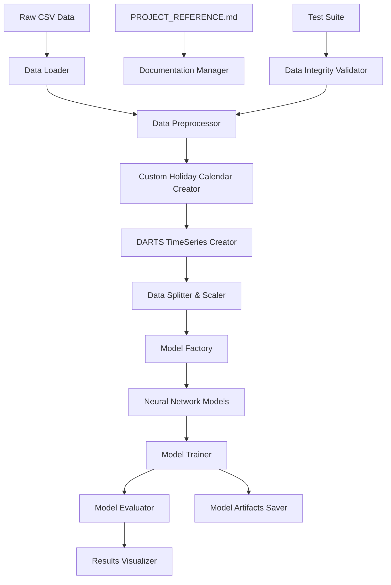

# Design Document

## Overview

The DARTS Stock Forecasting System is designed as a comprehensive time series prediction pipeline that leverages DARTS neural network models to forecast stock prices 5 business days into the future. The system handles multi-variate financial data with custom business day calendars, proper data scaling, and comprehensive model evaluation.

The architecture follows a modular design with clear separation of concerns: data processing, time series creation, model training, and evaluation. The system is structured as a Jupyter-notebook-style Python script for easy experimentation while maintaining production-ready code quality.

## Architecture



The system follows a pipeline architecture where each component has a single responsibility and can be tested independently. The PROJECT_REFERENCE.md serves as the central documentation hub that must be consulted and updated throughout development.

## Components and Interfaces

### 1. Data Processing Layer

**DataLoader**
- Loads CSV data with proper datetime parsing
- Validates required columns (date, adjusted_close)
- Handles data type conversions
- Interface: `load_data(file_path: str) -> pd.DataFrame`

**DataPreprocessor**
- Removes non-numeric columns
- Sorts data by date ascending
- Validates data integrity
- Interface: `preprocess_data(df: pd.DataFrame) -> pd.DataFrame`

**CustomHolidayCalendar**
- Identifies missing business days in date range
- Creates pandas custom business day frequency
- Creates custom holiday definitions
- Interface: `create_custom_calendar(df: pd.DataFrame) -> (CustomBusinessDay, List[Holiday])`

### 2. Time Series Layer

**DartsTimeSeriesCreator**
- Converts pandas DataFrame to DARTS TimeSeries
- Applies custom business day frequency
- Validates TimeSeries properties
- Interface: `create_timeseries(df: pd.DataFrame, custom_freq: CustomBusinessDay) -> TimeSeries`

**DataSplitter**
- Implements 70/15/15 train/validation/test split
- Ensures temporal ordering
- Interface: `split_data(ts: TimeSeries) -> Tuple[TimeSeries, TimeSeries, TimeSeries]`

**DataScaler**
- Applies StandardScaler fitted only on training data
- Validates scaling statistics (mean ≈ 0, std ≈ 1)
- Interface: `scale_data(train_ts: TimeSeries, val_ts: TimeSeries, test_ts: TimeSeries) -> Tuple[TimeSeries, TimeSeries, TimeSeries, StandardScaler]`

### 3. Model Layer

**ModelFactory**
- Instantiates all available DARTS neural network models
- Configures models for multi-variate input
- Excludes machine learning models (ARIMA, etc.)
- Interface: `create_models() -> Dict[str, ForecastingModel]`

**TargetCreator**
- Creates 5-day future price prediction targets
- Ensures no data leakage
- Interface: `create_targets(ts: TimeSeries) -> TimeSeries`

**ModelTrainer**
- Trains models with CPU configuration
- Monitors train/validation loss
- Implements early stopping
- Interface: `train_model(model: ForecastingModel, train_ts: TimeSeries, val_ts: TimeSeries) -> TrainingResults`

### 4. Evaluation Layer

**ModelEvaluator**
- Generates prediction vs actual comparisons
- Calculates accuracy metrics (MAE, RMSE, MAPE)
- Validates model performance consistency
- Interface: `evaluate_model(model: ForecastingModel, test_ts: TimeSeries) -> EvaluationResults`

**ResultsVisualizer**
- Creates prediction vs actual plots
- Generates performance comparison charts
- Displays feature column summaries
- Interface: `visualize_results(results: Dict[str, EvaluationResults]) -> None`

**ModelArtifactSaver**
- Saves trained models (.pt files)
- Persists scalers and preprocessing artifacts
- Maintains model metadata
- Interface: `save_artifacts(model: ForecastingModel, scaler: StandardScaler, metadata: Dict) -> str`

### 5. Documentation and Testing Layer

**ProjectReferenceManager**
- Maintains PROJECT_REFERENCE.md
- Updates directory structure
- Tracks function signatures and data schemas
- Interface: `update_reference(component: str, changes: Dict) -> None`

**DataIntegrityValidator**
- Implements comprehensive data validation checklist
- Validates TimeSeries properties
- Checks scaling statistics
- Interface: `validate_data_integrity(ts: TimeSeries, scaler: StandardScaler) -> ValidationReport`

## Data Models

### Core Data Structures

```python
@dataclass
class StockData:
    date: pd.Timestamp
    adjusted_close: float
    volume: int
    technical_indicators: Dict[str, float]

@dataclass
class TrainingResults:
    model_name: str
    train_loss: List[float]
    val_loss: List[float]
    training_time: float
    final_train_loss: float
    final_val_loss: float

@dataclass
class EvaluationResults:
    model_name: str
    predictions: np.ndarray
    actuals: np.ndarray
    mae: float
    rmse: float
    mape: float
    prediction_plots: List[plt.Figure]

@dataclass
class ValidationReport:
    data_integrity_passed: bool
    timeseries_validation_passed: bool
    scaling_validation_passed: bool
    issues: List[str]
    warnings: List[str]
```

### Data Schema

**Input CSV Schema:**
- `date`: datetime (YYYY-MM-DD format)
- `adjusted_close`: float (target variable)
- `volume`: int
- Technical indicators: float columns (Chaikin A/D, ADX, ATR, CCI, EMA, MACD, etc.)
- `symbol`: string (will be dropped)

**TimeSeries Schema:**
- Index: DatetimeIndex with custom business day frequency
- Values: Multi-dimensional array with scaled features
- Target: 5-day future adjusted_close values

## Error Handling

### Data Validation Errors
- Missing required columns → Raise `DataValidationError`
- Invalid date formats → Raise `DateParsingError`
- Non-numeric data in feature columns → Raise `DataTypeError`
- Insufficient data for splitting → Raise `InsufficientDataError`

### TimeSeries Creation Errors
- Index not strictly increasing → Raise `TimeSeriesIndexError`
- NaN values in TimeSeries → Raise `NaNValuesError`
- Holiday calendar mismatch → Raise `CalendarMismatchError`

### Model Training Errors
- Model convergence failure → Log warning, continue with next model
- GPU unavailable → Fallback to CPU mode
- Memory errors → Implement batch processing

### Scaling Validation Errors
- Incorrect scaling statistics → Raise `ScalingValidationError`
- Scaler fit failure → Raise `ScalerFitError`

## Testing Strategy

### Unit Testing Approach
1. **Data Processing Tests**
   - Test data loading with various CSV formats
   - Validate preprocessing steps
   - Test custom holiday calendar creation

2. **TimeSeries Tests**
   - Verify TimeSeries creation properties
   - Test data splitting ratios
   - Validate scaling transformations

3. **Model Tests**
   - Test model instantiation
   - Verify training loop functionality
   - Test prediction generation

4. **Integration Tests**
   - End-to-end pipeline testing
   - Real data validation
   - Performance regression testing

### Test Data Strategy
- Use real data from `covariaterawdata1.csv` when possible
- Create synthetic data for edge cases
- Implement data integrity validation checklist
- Test with various date ranges and missing data patterns

### Performance Testing
- Monitor train/validation loss trends
- Validate model performance consistency
- Test CPU-only execution
- Memory usage profiling

### File Naming Convention
- Test files: `TESTING_<component_name>.py`
- Test data: `TESTING_<data_description>.csv`
- Troubleshooting scripts: `TROUBLESHOOTING_<issue_description>.py`

## Implementation Notes

### Jupyter Notebook Structure
The main script will be structured with standardized cell division comments:
```python
# === CELL: markdown ===
# # Section Title
# Description of what this section does

# === CELL: code ===
# Actual Python code here
```

### DARTS Neural Network Models
Based on DARTS capabilities, the system will test these neural network models:
- RNNModel (LSTM/GRU variants)
- TCNModel (Temporal Convolutional Network)
- TransformerModel
- NBEATSModel
- TFTModel (Temporal Fusion Transformer)
- NHiTSModel
- DLinearModel
- NLinearModel

### Custom Business Day Handling
The system implements a sophisticated approach to handle missing trading days:
1. Identify complete business day range from min/max dates
2. Find missing dates by set difference
3. Create custom holidays for missing dates
4. Use nearest-workday observance for weekend holidays
5. Apply custom frequency to existing DataFrame index without gap filling

### Model Artifact Management
All trained models and preprocessing artifacts are saved for future use:
- Model weights: `{model_name}_model.pt`
- Scalers: `{model_name}_scaler.pkl`
- Custom calendar: `custom_business_calendar.pkl`
- Metadata: `{model_name}_metadata.json`